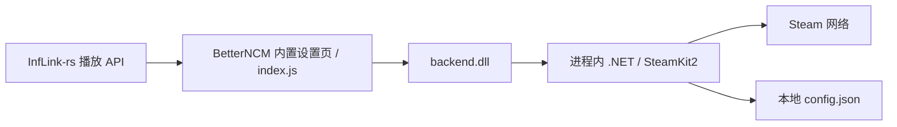

# BetterNCM 进程内插件方案（0.2.1）

## 已实现的结构

插件通过 InfLink-rs 的公开 `window.InfLinkApi` 读取歌曲、播放状态及毫秒时间线，每秒调用原生 `yysync.dispatch`。原生 `backend.dll` 用 Microsoft nethost / hostfxr 在网易云的渲染进程内加载 .NET 9 和 `yySync.Managed.dll`，复用 SteamKit2 与现有状态格式化代码。运行库 DLL 随包提供，插件没有 EXE、托盘或额外应用进程。

当前构建覆盖网易云音乐 2.10.13 / 3.x，包含 x86/x64 两套后端。包根目录 `backend.dll` 为 x86，`backend.dll.x64.dll` 为 x64；BetterNCM 尝试加载前者，位数不符时自动尝试后者。运行库和托管组件放在各自 `x86`、`x64` 子目录，按 DLL 自身位数选择，避免不同架构的同名系统依赖混用。

插件启动时只在 BetterNCM 的渲染进程标志存在时注册原生接口；CLR 加载发生在首次调用，避免在 Windows DLL 加载锁中启动运行库。通过 `.def` 固定导出名，防止 x86 C 符号修饰导致 `GetProcAddress` 查找失败。接口返回 JSON 文本，账户密码仅用于当前登录操作；令牌及设备验证数据不会返回 JavaScript。设置和 Guard 验证均在 BetterNCM 的 yySync-NCM 页面中完成。

## 路径比较

| 路径 | 开发难度 | 维护要求 | 当前选择 |
| --- | --- | --- | --- |
| 独立插件、InfLink API、进程内 .NET DLL | 中高 | 维护 BetterNCM 原生 ABI、CLR 宿主与 SteamKit2，包中包含运行库 | 已实现；复用原有 Steam 功能，不启动额外应用 |
| 直接集成到 InfLink-rs，桥接 .NET | 高 | 修改其 Rust/TypeScript 工作区；仍要维护 CLR 宿主和统一设置、打包流程 | 可行，但会扩大其职责并形成额外分支维护负担 |
| 直接集成到 InfLink-rs，改为 Rust Steam 客户端 | 很高 | 重写授权、令牌续用、Guard、重连、游戏状态等逻辑，并重新验证协议行为 | 不作为本次实现路线 |

不依赖 InfLink-rs 的独立插件还需自行适配网易云各版本的播放接口。目前仅在用户个人仓库修改，没有修改或向参考项目上游提交代码。

## 登录与重启

- 继续使用 `%LOCALAPPDATA%\yySync\config.json`，兼容旧版用户名、刷新令牌、设备验证数据及显示配置。
- 认证成功后立即保存令牌和新的设备验证数据，再建立 Steam CM 登录。写入使用临时文件替换，保存失败会在设置页显示错误。
- 重启及连接恢复时使用保存的令牌；超时、断网、服务不可用等错误保留凭据。
- 仅 Steam 明确返回 InvalidPassword、Expired、Revoked 时删除失效令牌。手动退出登录同时清除令牌和设备验证数据。
- 首次授权或 Steam 撤销授权后仍可能需要手机验证；插件不跳过 Steam 的验证要求。

状态在重连成功后重新发送，即使歌曲文字没有改变。暂停是否清除状态可在设置页配置。正常卸载时取消登录任务、清除状态并断开连接；进程异常退出时由 Steam 处理断线状态。

## 原生加载与升级

原生库和 CLR 在宿主存续期间保留，更新 DLL 必须彻底退出网易云音乐后重启。0.1.x 的外部 yySync 进程应先从托盘退出，或在任务管理器结束 `yySync.exe`，以解除旧插件解压目录占用。进程内版不再使用播放快照文件或辅助程序启动逻辑。

0.2.0 仅含 x64 DLL，在 2.10.13 上触发加载失败及 `invalid api id`。0.2.1 补齐双架构，初始化检查原生接口是否注册；加载失败时禁用登录和设置，显示具体排查位置，提供“重试加载组件”。

原独立程序源码保留 QQ 音乐、洛雪音乐等能力；进程内插件只读取网易云音乐。不要同时运行两个版本，以免争用相同 Steam 登录会话。

## 构建与验证

`scripts/build-plugin.ps1` 默认使用 MSVC 构建通用包，分别发布 x86/x64 托管类库、构建原生 DLL、复制相应的私有 .NET 运行库，再压缩为 `.plugin`。MinGW 可用于单架构构建。CI 安装 x86 运行库并使用 MSVC 构建两套后端。运行库及原项目授权文件一起打包。

已提供以下离线检查，不访问真实 Steam 账户：

- 分别使用 x86/x64 原生测试宿主验证 DLL、nethost、hostfxr、CLR 的 PE 位数、BetterNCM 接口布局、导出名、参数类型、进程内加载和正常进程退出。
- JSON 调用验证设置白名单、凭据不泄露至前端、退出登录、UTF-8 长度及表情截断。
- 两个独立进程验证凭据落盘与重新读取，并验证临时网络错误不使令牌失效。
- 设置页检查原生调用、密码清空、验证码交互、播放进度转换及卸载。

真实网易云中的 DLL 共存、Steam 手机授权及重启后的令牌有效性仍需安装后的实机验证。安装包内运行库增加包体积，但无需用户另装 .NET。
